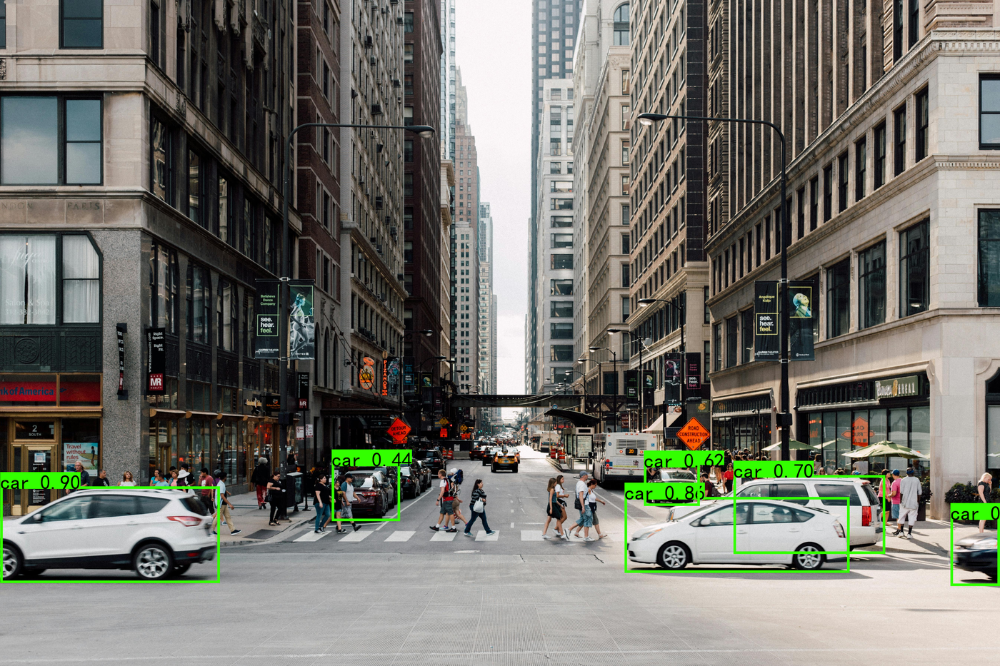
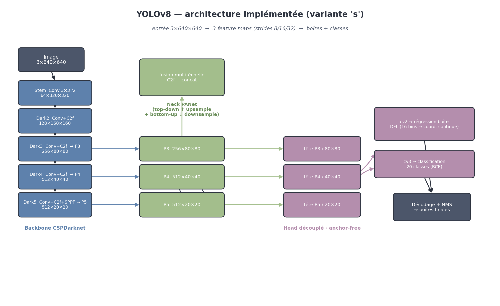
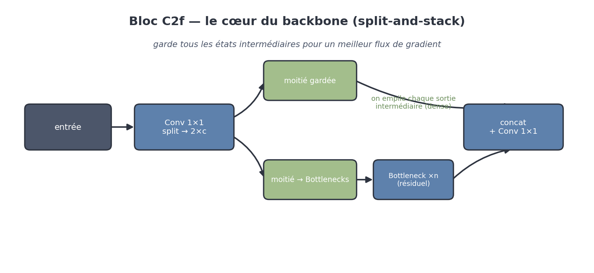
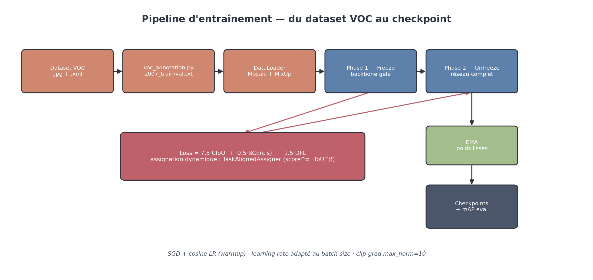

<div align="center">

# AI + Computer Vision · YOLOv8 from Scratch @ 东软集团 NEUSOFT

### Autonomous-Driving Road-Object Detection — built, evaluated & debugged end-to-end in PyTorch

**Computer-Vision internship at [Neusoft Corporation · 东软集团](https://www.neusoft.com/)** — China's first listed software company · 20+ years in autonomous-driving visual perception

*A road-object perception model — not a wrapper around a library.*

**Sami El Akkad** · Applied AI / Computer Vision · Summer 2024

[](https://github.com/Samielakkad/AI-Computer-Vision-YOLOv8-Neusoft/actions/workflows/ci.yml)
[](LICENSE)
[](https://www.neusoft.com/)
[](#)
[](https://pytorch.org/)
[](#)
[](#architecture)
[](#evaluation--how-i-measure-it)

</div>

---

## TL;DR

I built a **self-driving-style object detector** — the kind of model that spots cars, pedestrians and cyclists from a camera — **from zero** in PyTorch, then took it all the way to a **working, measured, deployable** state.

Three things make this more than a tutorial:

1. 🧱 **Built from scratch, not imported.** The network, the loss function, the label assignment and the training loop are all written by hand — I understand every layer, not just the API call.
2. 🔧 **I made it actually run end-to-end.** Taking the pipeline to a clean working state meant tracking down and fixing **five real bugs** across the model-loading, decoding and evaluation code — the kind of in-the-weeds debugging a *forward-deployed* engineer does in the field.
3. 📏 **I measure it like a product.** It ships with a real **evaluation harness** (mAP@0.5, per-class precision/recall) — and I found and fixed a defect that had been silently reporting the accuracy as **zero**.

> **Skills on display:** Applied AI · Computer Vision · PyTorch · end-to-end ownership (data → train → evaluate → debug → deploy) · model evaluation & quality.

## It runs

End-to-end detection on a real street scene — checkpoint loaded, decoded and drawn by the code in this repo:

<div align="center">

</div>

*Output of `predict.py` on a city street — the detector localises the vehicles with high confidence. (From a short proof-of-pipeline training run, so it is confident on the dominant road class here rather than every object in the frame.)*

## Why this is more than a tutorial project

| What I did | Why a recruiter should care |
|---|---|
| **Built YOLOv8 from scratch** — backbone, neck, decoupled head, DFL, full loss | Deep technical command of modern object detection, not just library usage |
| **Owned the entire loop** — dataset prep → training → evaluation → debugging → inference | The full *applied-AI / forward-deployed* skill set in one project |
| **Debugged a broken inference + evaluation stack** to a working state | Exactly what shipping AI in the real world looks like — things break, you fix them |
| **Built the measurement layer** (mAP, precision/recall, per-class) | Product-minded: I care whether the model is actually *good*, not just whether it runs |
 
## What it does

A complete YOLOv8 detector for **road-object perception** — vehicles, pedestrians, cyclists and other street objects — the kind of computer-vision model used in **autonomous-driving and ADAS** research. Trained on a **20-class PASCAL-VOC-format dataset (~21k images)** at 640×640 using the **YOLOv8-s** variant (~11M parameters).

## Why I built this — and what Neusoft uses it for

> **About Neusoft (东软集团).** Founded in 1991 in Shenyang, **Neusoft Corporation** is **China's first listed software company** and one of the country's largest IT-services groups — **~20,000 employees**, operations across China, Japan, Europe, the US and Malaysia, and clients in 100+ countries. It built **China's first home-grown CT scanner** (1996) and runs the nation's **largest cloud-hospital network** (500+ tertiary hospitals, 700M+ people). Its **intelligent-vehicle** arm, **Neusoft Reach (东软睿驰)**, has **20+ years of R&D in autonomous-driving AI visual-perception algorithms** and ships **mass-production ADAS** in passenger cars.

**Why object detection is the project.** Before a car can brake, steer or park itself, it has to *see* — to find every vehicle, pedestrian and cyclist in the camera frame, in real time. That perception layer is the foundation the entire autonomous-driving stack is built on. This project implements that layer from first principles: a YOLOv8 detector that turns a raw road image into labelled, localised objects.

**Where this fits at Neusoft.** Camera-based road-object detection is core perception for the products Neusoft's intelligent-driving business ships — its **front ADAS** modules (built on Ambarella vision SoCs, in mass production since 2021), **driver-monitoring systems**, and **L2-and-above** assisted-driving features up to navigation-on-autopilot (NOA), now part of Neusoft's **A³ Cockpit-Driving-Parking** platform launched under its 2024 intelligent-solutions strategy. My internship sat on the R&D side of exactly this: training and evaluating detectors that recognise road objects with high precision — which is why I rebuilt YOLOv8 end-to-end rather than treating it as a black box.

*Sources: [Neusoft — company profile](https://en.wikipedia.org/wiki/Neusoft) · [Neusoft Reach × Ambarella, mass-production ADAS (2024)](https://www.edge-ai-vision.com/2024/04/neusoft-reach-and-ambarella-forge-strategic-partnership-to-drive-advancements-in-autonomous-driving-and-intelligent-automotive-technology/) · [Neusoft AI-powered intelligent mobility, Auto Shanghai 2025](https://www.neusoft.com/neusoft-launches-three-product-portfolios-for-ai-powered-intelligent-mobility-at-auto-shanghai-2025/).*

## Architecture



Three classic stages, each implemented explicitly in [`nets/backbone.py`](nets/backbone.py) and [`nets/yolo.py`](nets/yolo.py):

| Stage | What it does | Key idea |
|---|---|---|
| **Backbone — CSPDarknet** | image → feature maps at strides 8/16/32 (P3/P4/P5) | `C2f` blocks split-and-stack features for richer gradient flow; `SPPF` widens the receptive field cheaply |
| **Neck — PANet** | fuses the three scales top-down then bottom-up | small objects keep high-res detail, large objects keep deep semantics |
| **Head — decoupled, anchor-free** | separate box (`cv2`) and class (`cv3`) branches per scale | **DFL** predicts a 16-bin distribution per coordinate and takes its expectation → continuous boxes without anchors |

<details>
<summary><b>The C2f block — heart of the backbone (click)</b></summary>


</details>

## Training



The recipe in [`train.py`](train.py) is how you actually train a detector on a single GPU with limited memory:

- **Two phases** — *freeze* the pretrained backbone first (fast, stable, cheap on VRAM), then *unfreeze* and fine-tune the whole network.
- **Loss** = `7.5·CIoU + 0.5·BCE(cls) + 1.5·DFL`, with positives chosen by the **TaskAlignedAssigner** (`align = score^α · IoU^β`), coupling classification confidence and localisation quality during label assignment.
- **Stabilisers** — EMA weights, cosine LR with warmup, LR scaled to batch size, gradient clipping, Mosaic + MixUp augmentation.

A short training run shows the loss collapsing as expected — the random head converging toward a real detector:

| Epoch | Train loss | Val loss |
|---|---|---|
| 1 | 55.81 | 3.56 |
| 2 | 4.16 | 3.61 |
| 3 | 4.15 | 3.63 |

## Evaluation — how I measure it

A model you can't measure is a model you can't trust, so the repo ships a full evaluation pipeline in [`get_map.py`](get_map.py) and [`utils/utils_map.py`](utils/utils_map.py):

- **VOC mAP@0.5** and **COCO mAP@0.5:0.95**,
- **per-class precision / recall** at any confidence threshold,
- prediction vs. ground-truth comparison over the held-out test set.

One command — `python get_map.py` — runs the full sweep over the **2,151-image held-out test split** and writes the per-class AP table plus precision/recall curves.

**The part I'm proud of:** when I went to evaluate, the metric came back **0** for every run. I traced it down — the mAP module had a character-encoding corruption that stopped it compiling at all, and `get_map.py` was missing its entire evaluation body. I fixed both. *Finding out **why** a metric is lying to you, and fixing it, is the core of doing AI well.*

## Repository layout

```
config.py            # single source of truth for all paths (relative, portable)
train.py             # two-phase freeze/unfreeze training loop
predict.py           # inference: image / video / fps / folder / heatmap / ONNX
yolo.py              # YOLO inference class (preprocess → decode → NMS → draw)
get_map.py           # VOC mAP@0.5 / COCO mAP@0.5:0.95 evaluation
voc_annotation.py    # builds train/val splits from VOC XML
nets/                # backbone (CSPDarknet) · YoloBody (PANet + DFL head) · loss
utils/               # dataloader (Mosaic/MixUp) · bbox decode/NMS · mAP · callbacks
figures/             # architecture diagrams (make_diagrams.py) + detection sample
```

*(The ~21k-image `VOCdevkit/` dataset, `*.pth` weights and training `logs/` are intentionally not committed — see [`.gitignore`](.gitignore).)*

## How to run

```bash
pip install -r requirements.txt

python voc_annotation.py   # build splits + annotation files from a VOC-format dataset
python train.py            # train (hyper-params at the top of train.py)
python predict.py          # detect — set `mode` for image / video / heatmap / ONNX
python get_map.py          # evaluate (mAP, precision/recall)

pytest -q                  # run the architecture tests (CPU, no weights needed)
```

> CI runs these tests on every push (see the badge above), and a [`Dockerfile`](Dockerfile) gives a reproducible CPU environment: `docker build -t yolov8 . && docker run yolov8`.

## What this project demonstrates

- **Applied AI / Computer Vision** — modern object detection implemented and understood end-to-end, not abstracted behind a library.
- **Forward-deployed engineering** — taking an imperfect codebase and *making it work*: loading, decoding, evaluating, debugging until it runs cleanly in the real world.
- **Product & evaluation thinking** — building the measurement layer and insisting on knowing whether the model is genuinely good.
- **Ownership** — one person, the whole pipeline: data, model, training, metrics, inference.

## Tech stack

`Python` · `PyTorch` · `NumPy` · `OpenCV` · `Pillow` · `matplotlib` · `tqdm` · VOC-format data · TensorBoard logging · ONNX export.

## Author

**Sami El Akkad** — built during the computer-vision internship at **Neusoft**, summer 2024. MSc in Artificial Intelligence, Tsinghua SIGS. *Code documented in French.*

📧 [sam25@mails.tsinghua.edu.cn](mailto:sam25@mails.tsinghua.edu.cn) · 🔗 [LinkedIn](https://www.linkedin.com/in/samielakkad)

---

<div align="center">
Built from scratch · debugged end-to-end · measured like a product.
</div>
